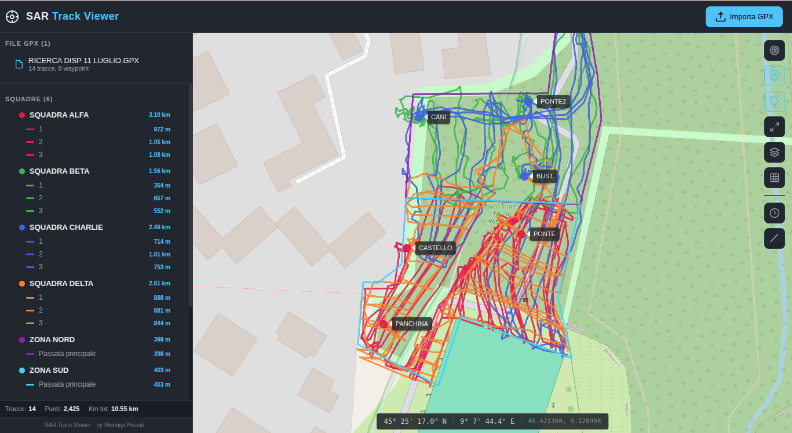
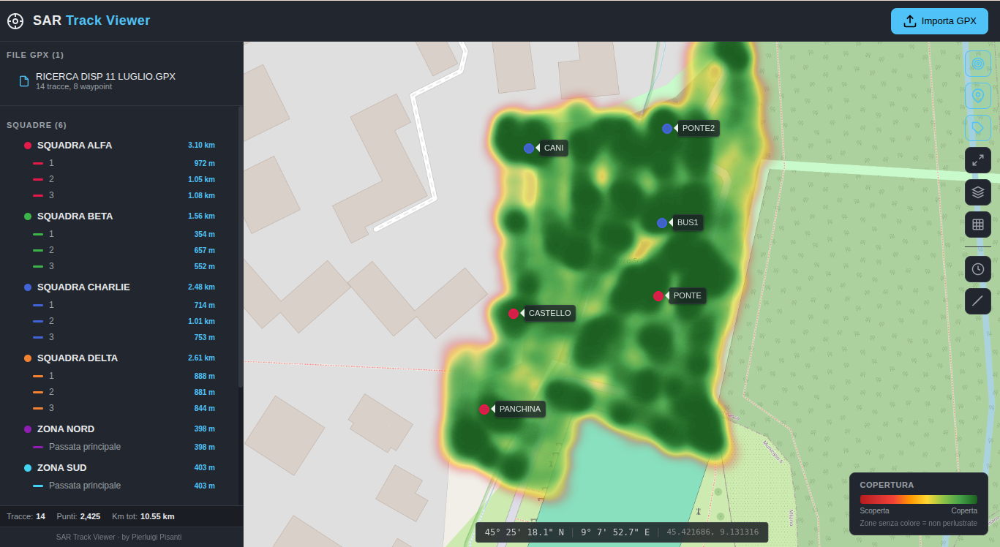
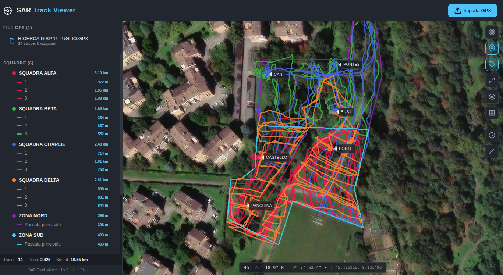

# SAR Track Viewer — Tracce GPX per Ricerca e Soccorso (SAR) e Protezione Civile

Visualizzatore di tracce **GPX** per operazioni di ricerca e soccorso (SAR) e Protezione Civile. Importi i GPX delle squadre e vedi su mappa **dove hanno cercato**, **quanto**, e soprattutto **dove non è ancora passato nessuno**.

Gratuito, a codice aperto, gira in locale senza installazione: un solo eseguibile, doppio clic, si apre nel browser.



## A cosa serve

In una ricerca dispersi ogni squadra registra la propria traccia GPS. Il problema non è raccogliere i GPX, è **leggerli insieme**: capire a colpo d'occhio la copertura del territorio per non ricercare due volte la stessa zona e — molto peggio — per non lasciarne fuori nessuna.

- **Import GPX multiplo** — carichi tutti i file delle squadre in una volta (drag & drop o pulsante).
- **Squadre e tracce colorate** — ogni squadra un colore, distanza per traccia e totali (km percorsi, punti, numero tracce).
- **Waypoint** — punti notevoli (CANI, BUS, PONTE, CASTELLO…) con simbolo ed etichetta.
- **Heatmap COPERTURA** — la vista che conta: rosso→verde = poco→molto battuto, **zone senza colore = non perlustrate**.
- **Timeline** — replay temporale della ricerca a velocità regolabile: vedi come si è mossa ogni squadra nel tempo.
- **Basemap** — mappa stradale (OpenStreetMap), topografica (OpenTopoMap) e **satellite**.
- **Righello e griglia coordinate** — misuri distanze e leggi le coordinate in gradi/DMS.





## Come si usa (utente)

1. Scarica l'eseguibile per il tuo sistema dalla pagina [Releases](../../releases).
2. Doppio clic. Si apre da solo nel browser predefinito.
3. **Importa GPX** e carica i file delle squadre.

Nessuna installazione, niente da configurare, nessun account. Per chiuderlo basta chiudere la finestra del terminale che si apre.

> **Serve la connessione** solo per lo sfondo mappa (le tile arrivano da OpenStreetMap/OpenTopoMap/satellite). Le tracce GPX si vedono comunque; senza rete resta lo sfondo grigio.

## Come si compila (sviluppatore)

Frontend (React 19 + Vite + Leaflet):

```bash
npm install
npm run build      # genera dist/
npm run dev        # sviluppo con HMR
```

Eseguibile autonomo (Go incorpora `dist/` con `go:embed`):

```bash
npm run build
go build -o sar-track-viewer .
```

Cross-compilazione (nessuna dipendenza C, `CGO_ENABLED=0`):

```bash
CGO_ENABLED=0 GOOS=windows GOARCH=amd64 go build -ldflags="-s -w" -o SAR-Track-Viewer-windows.exe .
CGO_ENABLED=0 GOOS=darwin  GOARCH=arm64 go build -ldflags="-s -w" -o SAR-Track-Viewer-macos-arm64 .
CGO_ENABLED=0 GOOS=linux   GOARCH=amd64 go build -ldflags="-s -w" -o SAR-Track-Viewer-linux .
```

`main.go` fa una cosa sola: apre una porta effimera su `127.0.0.1`, serve la `dist` incorporata e apre il browser.

## Licenza

[CC BY-NC-SA 4.0](LICENSE) — libero di usarlo, modificarlo e ridistribuirlo per **usi non commerciali**, mantenendo l'attribuzione e la stessa licenza.

by Pierluigi Pisanti
